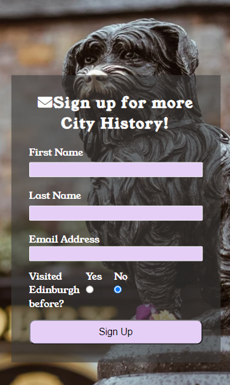
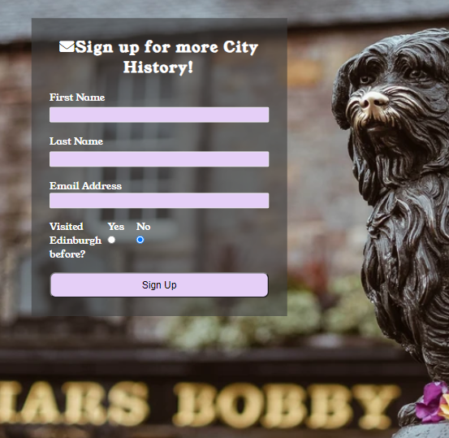

# Edinburgh Responsive and Interactive Website

# Website Purpose
This project is an optimised and interactive website aimed at providing historical information to any tourists or people who have a general interest in Edinburgh's history through the ages.

The core purposes of the website:
- to provide specific historical information regarding edinburgh through several ages of time.
- to provide information on places of interest in edinburgh.
- to provide enough information that will make tousits wants to come and visit edinburgh.

The website has been built using HTML and CSS, and is the final submission for the project#1 section of the Code Institute's Full Stack Developer course.

[The live website can be viewed via this link](https://tomboxhall.github.io/history-of-edinburgh/)

---

# UX Design
## User Stories
### As a **first time user** of the website

- I want to be able to easily and clearly understand the purpose of the website, and be able to learn from the information.
- I want to be able to easily navigate around the site, and to easily find the content i require.
- I want to find a way to **sign up** to the website to receive more information in the future.
- I want to have a pleasant experience using the website.

### As a **returning and frequent user** of the the website

- I want to be able to receive updates of changes, or developments on the site regarding things to do.
- I want to be able to contact the website developers to add/remove any content that is no longer valid.
- I want to find up to date information.

### Accesibility 
  
- Users shall be able to use all types of devices due to the website being optimised for Mobile, Tablet and PC.

## Structure
### Home Page
- The home page introduces the whole topic of the website and main purposes on the first page.
- Provides a complete overview of the topic, ranging from current to past times information.
- Each page is clearly laid out, and information if specific to the topic on each page.
- Keep the users attention engaged, through use of soft colour schemes, and engaging interactive features.
    #### User's Goal:
    > - Be able to navigate the multiple pages with simplicity and ease.
    > - Be able to recognise and understand the main purpose of the website.
    > - To have a fun experience, and to find the interactive features engaging.

### History Page
- Provides historical information about edinburgh throughout the ages.
- Allows the user to engage with the images in an interactive way.
    #### User's Goal:
    > - Provide information starting in the Medieval times, and ranging all the way up to 19th century.
    > - Be able to enlarge the images for a clearer look.

### Contact Us Page
- Allows users to signup to receive more information whenever it is uploaded.
    #### User's Goal:
    > - User's may also use Contact us feature to request specific information about the content.

---

## Wireframes

### **Home**

### **History**

### **Contact Us***

---

## Design

As the Edinburgh site is mainly an information website, the design layout was chosen to make it simple and easy to keep the information clear and precise. It was designed so that the first thing people would see would be the modern day information about Edinburgh, along with a modern day image. They would then progress down to a 'Historical Activites' section which would outline the main tourist attractions for visitors. Having images allows the user to see what the information is describing first hand. The History page is where the bulk of the factual historical information is found, and the design was chosen to provide a simple layout leaving no room for distraction away from the core information.

### Colour Scheme

The colour palette chosen was due to the national colour of scotland being purple, it was also chosen becasue the different tones of purple are very soft and appealing on the eye, which in turn would give the user a pleasant experience.

### Typography

[Young-Serif](https://fonts.google.com/specimen/Young+Serif?query=young)
- Young Serif was chosen to be the font throughout the entire website due to its **historical** appearance, its similar to how i would image handwritten text to have looked in the previous ages. It is also bold and clear, yet satisfying on the eye.

### Images

The images used in this project were mainly sourced from [Unsplash](https://unsplash.com/) and [Google](https://www.google.co.uk/) They were specifically chosen as they correlate with the information of the website. The Hero images were chosen as they provide eye catching scenic views of the city of edinburgh, including historical places of interest. The history page contains images sourced from Google, due to the timeframe they are from it was only available option, they also provide a good visual represnetationof the timeframes they're related too.

### Visual Effects

#### Images Hover Effects
Majority of the images on the website have a **Hover:Grow** effect on them, this was chosen so that the user could enlarge the image to get a better look, it also adds a fun level of interaction on the website and creates levels to the page.

#### Background Gradients
The Edinburgh website was designed to have excess free space around the information, the decision was made to apply a gradient background to make it more pleasant. It also helps to blend the information sections in with the overall aesthetic of the page. Also chosen as personally believe that a gradient encourages the user to start at the left and lighter side and read the information moving to the right where the colour is bolder. 

#### Links and their Hover Effect
Due to the colour choice of the website it was essential that the Links stood out, and were positioned clearly so that the user would have no confusion about where and what the function was. An added **Hover:Grow** effect was added for a similar reason to the images, it provides depth and a level of interaction to the website. The effect is only implemented for screen sizes of 1200px and above.

#### NavBar Hover Effect
The NavBar includes a **Hover:Over** effect that will be appealing to the user. When the User hover's over the navbar the underline will move in from the left and leave via the right. The effect helps to add a sort of 3D effect to the navbar, and is visually appealing to engage with. The effect is only implemented for screen sizes of 1200px and above.

#### Buttons
The button on the contact form changes colour when hovered over, and the text input fields highlight a different colour to let the user know that is where theyre due to put their information in. It's a visual indicator that is quite effective across most modern websites.

---

# Features
## Existing Features
- **Navigation Bar**

Each of the webpages has a fully responsive navigation bar located at the top, on the left you have the logo, which is also a hyperlink to the home page, and on the right you have the links to Home, History and Contact Us pages. Throughout the different optimisations it always maintain the same appearance and style, this allows the user to get familiar with its layout, and keeps it clear whare each link will direct the user throughout the website. Each NavBar menu hyperlink has a Hover effect added to it, which adds a level of interaction and visual queue for the user which one they're hovering over.

When viewed on mobile, the NavBar will appear as a **hamburger** icon, and the menu is fully CSS functional to drop down, with a transparent background as to add a nice visual gradient and depth to the website.

**Hero Image**

This will be the first thing the user will set eyes on, the image has been chosen as it is an iconic Edinburgh attraction, and wherther the user has read about it or seen it before it plays an important role in early engagment with the website. There is an overlay text which includes the Website title, and a brief description as to what they can expect to read about throughout the website. The transparency of the overlay box has been adjusted so that it doesnt obstruct the Hero Image, but also keeps the content readable. A similar approach has been used on the History Page Hero image, this is also an iconic view that visitors to Edinburgh can expect to see. All Hero images have been optimised so that they maintain their quality throught all screen sizes from Mobile to Desktop.

**Introduction Section**

The Introduction section will be the main welcoming of the user to the website, this is where they will start their journey and begin learning about Edinburgh. The section includes a heading with an icon of a castle, which was chosen because Edinburgh Castle is the main tourist feature of the city, and the use of the icon will engage the user and subtly compliment the historical tie between Edinburgh and the Castle. 

The three information boxes go further into detail as to what the user can do on arrival in Edinburgh, the **What to See**, **What to Do** and **When to Visit** headings provide precise and useful information, and content is direct and informative. They have a **Hover:Grow** effect, that when Hovered over they grow slightly, this adds a level of interaction to the website.

Below these is an image of a Scottish bagpipes musician, this is another Scottish national Icon, and the use of it in this section is to re-iterate the rich historical heritage, and what the user can expect to see and hear if they visit.

When viewed on Mobile and Ipad sized screens, the Introduction section due to optimisation will change from a horizontal format to a vertical format, and the three information boxes will no longer have the Hover effect. They still maintain the same information and style, but designed to fill the available space.

**Historical Attractions**

The Historical Attractions section will be where the user can see and read about main attractions to Edinburgh. It maintains the similar layout to the Intoduction above, so as to keep the website uniformed and familiar. The main focus of this section is the three images showing rhe **Castle**, **Museum** and **Old Streets**. The use of box shadowing around the images helps to add a layer of depth, and bring the images out of the webpage and more into the attention of the user. There is a **Hover:Grow** effect added to the images to add a level of interaction to the website, it also enlarges the images for the user to get a bigger view of the chosen images. The information is positioned to the left hand side, and headings have a gradient effect to make them stand out from the background, and highlight exactly what each image is.

When viewed on a Mobile or Ipad sized screen, the layout of these screen changes from a horizontal format to a vertical layout. They still maintain the same information and style, but designed to allow the user to read the information first and then refer to the image for confirmation.

**About Us and Footer**

The About Us section provides a short roundup of content to let the user know About the person/company behind the website. It helps to add a personal level to the website, and informs the user about the aims and goals. Underneath the content is a hyperlink that will direct the user to the **Contact Us** page, it also has the same Hover effect applied as the NavBar menu.

The footer contains the links to the social media platforms, and allows the user to continue their engagement beyond the website. A **Hover:Grow** effect has also been added to add an interactive aspect, and also gives a visual queue as to which one theyre hovering over for the visually impaired.

The About Us and Footer section are both optimised for Mobile and Ipad screens, and maintain the same content and style, but positioned for each size screen.

**History Page**

The History page is where the user can find the core content regarding the **History of Edinburgh**, it provides detailed information regarding the different historical ages of Edinburgh, ranging from Medieval to 19th Century. The layout was chosen to be uniformed, and adhere to the ethos of the website of being a informational first website. Alongside the content is an image as point of reference to what the content is relating too. 

The **border box shadow** and **Hover:Grow** styles have been maintained on this page of the website to keep it familiar and interactive with the user. As stated before the use of the box shadow is effective in making the images stand out from the background, and the hover effect makes the image come to life up out of the website when the user moves their cursor over the image.

The headings have the same colour gradient effect as the Home page, this is too keep the visual queue's of the website familiar to the user, and also adds a nice, subtle styling that works well with the background.

On a mobile screen size the content changes its layout to a vertical layout, this is due to the optimisation screen width. All content and styles remain the same however, without the Hover effects.

On an ipad screen size the content remains the same as a desktop, it has been optimised to fit the screen width. However it also looses the Hover effects due to the loss of a cursor.

**Signup Page**

This page allows the user to sign up to the Edinburgh website, and in turn receive further information about the City. The page's main feature is the form where they will be able to submit their First Name, Last Name, Email Address and select whether or not they have visited the city before via radio buttons. The background image has been included to add a 'feel good factor', and the image is of greyfriars bobby, a famous dog in the city, of which the user will be able to visit the statue if they decide to visit. 

ADD IMAGE ONCE FIXED.

The Signup page has also been optimised for Mobile and Ipad screens, the content remains the same but the positioning has been adjusted so that it does not interfere with the NavBar menu dropdown function, this was chosen so there wouldnt be any overlapping of content. The form size has also been adjusted to better fit the screen, the background image remains the same and centered throughout.

CHANGE THE SCREENSHOTS WHEN AMMENDMENTS ARE MADE

## Responsive Layout

The website has been designed to be simple and informative at first, but underneath the that it was also designed to be responsive and aesthetically pleasing to use. The goal was to provide a website that a user would run into no issues using, it has also been optimised for all screne sizes and resolutions. The smallest screen size being a Mobile screen starting from 350px, all pictures, content and animations are built to suit this. The images chosen has been optimsed and positioned on the screen for this specific screen size so that they fit in proportion, but also remain the main vocal points. The hero image is the main image, and this remains the main focal point when users first access the site, so the positioning was of most importance. A similar approach was taken to the backgroud image on the Contact Us page, it was important to make sure the form did not clash, and cause any visual confusion.

The breakpoints on this website were chosen by researching the most popular devices, and their subsequent screen sizes. My results showed me an Iphone, Ipad and Desktop were most popular, and therefore the 350px, 768px and 1200px were used. However, 767px and below, and 992px and above were also used for single CSS commands due to particular features required within each of these breakpoints. The use of Flexbox and Grid layouts aided in keeping all content where it is supposed to be, and the transition between screen sizes seemlessly.

# Technologies

- HTML for the structure of the website.
- CSS for styling of the content of the website.
- [Codeanywhere](https://dashboard.codeanywhere.com/) Codeanywhere as the IDE to develop the website on.
- [Github](https://github.com/) Github for hosting the source code, and Github pages for deploying the live site through.
- Git, for commiting and pushing any changes to their code to the repository.
- [Chrome dev tools](https://developer.chrome.com/docs/devtools/) For testing layouts, debugging and general tweaking of the code.
- [Google Fonts](https://fonts.google.com/) Providing the fonts.
- [FontAwesome](https://fontawesome.com/) Providing the Icons.
- [Balsamiq](https://balsamiq.com/) For designing the WireFrames.
- [CloudConvert](https://cloudconvert.com/jpg-to-webp) Converting JPG images to WEBP, for better optimisation on the website.
- [Techsini](https://techsini.com/multi-mockup/) To create the Mockup of the website used in this README.
- [Colorhunt](https://colorhunt.co/palette/5b0888713abe9d76c1e5cff7) To source the Color Paletre used in this website.
- Google Chrome Lighthouse - To check Accessibility.
- [Toptal](https://www.toptal.com/designers/colorfilter) For checking the Color-blind accessibility.
- [W3C HTML Markup Validator](https://validator.w3.org/) Validate the HTML code of the website.
- [W3C CSS Markup Validator](https://jigsaw.w3.org/css-validator/#validate_by_input) Validate the CSS of the website.

# Automated Testing

**[W3C Jigsaw CSS](https://jigsaw.w3.org/css-validator/) CSS Validation**
- The CSS stylesheet was tested and no errors were detected.

**[W3C HTML Markup](https://validator.w3.org/) HTML Validation**
- The HTML on all pages was run through the validator and no errors were detected.

**[Google Lighthouse](https://chrome.google.com/webstore/detail/lighthouse/blipmdconlkpinefehnmjammfjpmpbjk)**

**Home Page**

Mobile

Desktop

**History Page**

Mobile

Desktop

**Contact Us**

Mobile

Desktop

# Accessibility Testing

### Toptal Colorfilter

This website has been tested using [Toptal Colorfilter](https://www.toptal.com/designers/colorfilter), and no accessibility issues were detected.

[Result 1](https://www.toptal.com/designers/colorfilter?orig_uri=https://tomboxhall.github.io/history-of-edinburgh/index.html&process_type=protan)
[Result 2](https://www.toptal.com/designers/colorfilter?orig_uri=https://tomboxhall.github.io/history-of-edinburgh/index.html&process_type=deutan)
[Result 3](https://www.toptal.com/designers/colorfilter?orig_uri=https://tomboxhall.github.io/history-of-edinburgh/index.html&process_type=tritan)
[Result 4](https://www.toptal.com/designers/colorfilter?orig_uri=https://tomboxhall.github.io/history-of-edinburgh/index.html&process_type=grey)

### Screen Reader

This website has been tested with [Screen Reader for Google Chrome](https://chrome.google.com/webstore/detail/screen-reader/kgejglhpjiefppelpmljglcjbhoiplfn), And no issues were detected.

# Deployment

This project was deployed to Github pages, a step by step guide to deploy is as follows:

1. Log into [Github](https://github.com/Tomboxhall/history-of-edinburgh).
2. Choose `history-of-edinburgh` in the list of repositories.
3. Select `settings` in the repositories sub headings along the top.
4. In the left hand side menu, select the `pages` link within the `code and automation` section.
5. Within the branch sub-section, under Build and Deployment select `main` in the dropdown menu.
6. Select the `root` in the dropdown menu to the right.
7. Press `save`
8. Finally a message should appear stating that the website is ready to be deployed, refresh the page, and the link should be available at the top of the page.